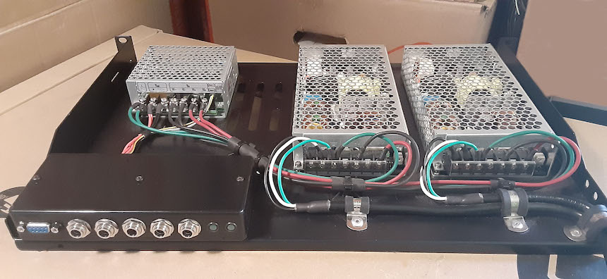

# Rackmount Redundant 12V Power Supply

This is a redundant, but not hot-swappable, 12VDC power supply.  It has these features:

 - Two AC cords.  Either cord can lose AC power without disrupting the 12VDC output.

 - Five 12VDC output jacks.  Any individual jack can supply ~6A maximum but the supply is only capable of providing ~16A maximum across all jacks.

 - Remote monitoring.  A serial port provides a simple "on/off" status that indicates when one of the two onboard DC supplies loses its AC power or otherwise fails.

It is built on a 1U rack shelf but requires at least 2U because it is slightly taller than 1U.  The extra air space is also needed for cooling because the supply has no fans.

## Background

Rackmount [Automatic Transfer Switches](https://web.archive.org/web/20220408134749/https://www.youtube.com/watch?v=JSWmmY9tKrM) from companies such as [APC](https://web.archive.org/web/20220408135631if_/https://download.schneider-electric.com/files?p_File_Name=BSTY-AQNP38_R0_EN.pdf&p_Doc_Ref=SPD_BSTY-AQNP38_EN&p_enDocType=Catalog) and [CyberPower](https://web.archive.org/web/20220408140138if_/https://www.cyberpower.com/tw/en/File/GetCyberpowerFileByDocId/DS-21040002-01) can be used to provide AC power redundancy for devices with a single AC cord.  I wanted redundant power for the single-corded devices in my rack and noticed that they all ran off 12VDC power bricks.  Instead of buying an ATS unit and plugging the bricks into it, I built this redundant 12VDC supply to eliminate the bricks.  It can be built for less than the cost of most ATS units.

## Parts List

| Part | Qty | Notes |
|------|-----|-------|
|[Meanwell ERDN40-12 12VDC Redundancy Module](https://www.mouser.com/ProductDetail/709-ERDN40-12) | 1 | [Datasheet](https://web.archive.org/web/20220407021145if_/https://www.meanwell.com/upload/pdf/ERDN40/ERDN40-spec.pdf) |
|[Meanwell MSP-200-12 12VDC 16.7A Power Supply](https://www.mouser.com/ProductDetail/709-MSP200-12) | 2 | [Datasheet](https://web.archive.org/web/20220407021309if_/https://www.mouser.com/datasheet/2/260/MSP_200_SPEC-1109886.pdf).  Selected for built-in protections and no required minimum current. |
|[Pinfox 10' 18 AWG 3 Prong Heavy Duty 120V 10A AC Cord](https://www.amazon.com/gp/product/B07QYRMD6D) | 2 | One AC cord for each MSP-200-12. |
|[Raising Electronics 701401004 19" 1U 12" Deep Rack Shelf](https://www.amazon.com/gp/product/B01M8HKRA7) | 1 | [Product Page](https://web.archive.org/web/20220408132026if_/https://risingracks.com/cantilever-server-shelf-vented-black-shelves-rack-mount-19-1u-12-300mm-deep/) |
|[10pc M3x6mm Plastic Pan Head Screw](https://www.ebay.com/itm/254913074827) | 1 | 10 screws used for mounting the Meanwell units to the shelf.  Plastic ensures no possibility of shorting. |
|[10pc M3x25mm Female-Female Steel Standoff](https://www.ebay.com/itm/113410581076) | 1 | 4 standoffs used inside the project box to mount it to the shelf and secure the lid |
|[25pc M3x8mm Pan Head Screw Steel Black](https://www.ebay.com/itm/111839544046) | 1 | 8 screws used with the 4 project box standoffs (2 screws per standoff) |
|[50pcs M3x6mm Nylon Standoffs with M3x6mm Nylon Screws](https://www.ebay.com/itm/262850128455) | 1 | 4 standoffs and 4 screws used to mount PCB inside project box.  Plastic ensures no possibility of shorting.  Standoffs are epoxied to the project box. |
|[Hammond 1591HSBK Project Box](https://www.digikey.com/en/products/detail/hammond-manufacturing/1591HSBK/130882) | 1 | [Datasheet](https://web.archive.org/web/20210928162934if_/http://www.hammondmfg.com/pdf/1591H.pdf), [Bulletin](https://web.archive.org/web/20220407164638if_/https://www.mouser.com/datasheet/2/177/1591-1389824.pdf) |
|[L-Com SDG400XS D-Sub 50pc Jackscrew/Washer/Nut](https://www.newark.com/l-com/sdg400xs/jack-screw-4-40-10-16mm/dp/63K2685) | 1 | [Datasheet](https://web.archive.org/web/20220827230745if_/https://www.l-com.com/Images/Downloadables/2D/SDG450XS_2D.pdf).  2 jackscrews, 2 lock washers, and 2 hex nuts used to mount DB9 to project box. |
|[5pcs DB9 Female to IDC Panel Mount](https://www.ebay.com/itm/311374355272) | 1 | 1 DB9 connector used to make the DB9-to-PCB cable inside the project box. |
|[10pcs 2x5 pin IDC Female](https://www.ebay.com/itm/323745402692) | 1 | 1 IDC connector used to make the DB9-to-PCB cable inside the project box.  The top of the strain relief must be shaved down a bit to fit in the box. |
|[Ribbon Cable 14 conductor 6' long](https://www.ebay.com/itm/282211468932) | 1 | Cut down to 10 conductors and 6" long, used to make the DB9-to-PCB cable inside the project box. |
|[DB9 Male/Female 5' Cable](https://www.mouser.com/ProductDetail/523-CS-DSDMDB09MF005) | 1 | [Datasheet](https://web.archive.org/web/20220719155819if_/https://www.mouser.com/datasheet/2/18/1/CS_DSDMDB09MF-2079775.pdf).  For direct connection between the box and a PC with a DB9 serial port. |
|[FTDI-US232R-100 1m USB-Serial Cable](https://www.mouser.com/ProductDetail/895-US232R-100-BLK) | 1 | [Datasheet](https://web.archive.org/web/20220828230546if_/https://www.mouser.com/datasheet/2/163/DS_US232R-10_R-100-500-1669828.pdf).  For connecting to a PC without a DB9 serial port, use this adapter together with the above DB9 cable. |
|[Lumex SSI-LXH387GD Panel Mount Green LED](https://www.mouser.com/ProductDetail/696-SSI-LXH387GD) | 2 | [Datasheet](https://web.archive.org/web/20221002231549if_/https://www.mouser.com/datasheet/2/244/LUMX_S_A0001762456_1-2551886.pdf).  Mounted on project box to show the "on" status of each power supply.
|[Switchcraft L712ASH 2.5mm Locking Barrel Socket](https://www.mouser.com/ProductDetail/502-L712ASH) | 5 | [Datasheet](https://web.archive.org/web/20220407035419if_/https://www.mouser.com/datasheet/2/393/L712ASH-L722ASH_CD-1110860.pdf), [Bulletin](https://web.archive.org/web/20220407164041if_/https://www.switchcraft.com/Documents/switchcraft_npb_637_high_temp_jacks_plugs.pdf).  Mounted on project box for DC outputs. |
|[Switchcraft 761KSH15 2.5mm Locking Barrel Plug](https://www.mouser.com/ProductDetail/502-761KSH15) | 5 | [Datasheet](https://web.archive.org/web/20220407035117if_/https://www.mouser.com/datasheet/2/393/761KSH-S761KSH_CD-1110850.pdf). See bulletin above for electrical info.  For building DC cables out to devices. |
|[14 AWG GXL Wire 10' Long](https://www.ebay.com/itm/293094627307) | 3 | 1 each: red, green, black.  Cut to length for high current DC wiring |
|[DC Extension Cable 18 AWG 12VDC 10A 33' Long](https://www.ebay.com/itm/133233779533) | 1 | Connectors cut off and discarded; used to make output cables and for wiring inside Project Box |
|[10pc Dupont 2x2 Female Housing](https://www.ebay.com/itm/141510327734) | 1 | 1 housing used to make ERDN40 alarm cable |
|[10pc Dupont 2-pin 26AWG Female-Female Jumper Cable](https://www.ebay.com/itm/254959908608) | 1 | 2 cables used to make ERDN40 alarm cable |
|[Molex KK 22-01-3077 7-pin Housing](https://www.mouser.com/ProductDetail/538-22-01-3077)| 1 | 1 housing used for PCB connector |
|[125pc Rubber Grommet Set](https://www.ebay.com/itm/221291687081) | 1 | 1 grommet used around wiring from ERDN40 into project box |
|[TICONN 80pc Stainless Steel Hose Clamp Set](https://www.amazon.com/gp/product/B094YP2F3D) | 1 | 3 hose clamps used for AC cord strain relief |
|[100pc 1/4" Aluminum Pop Rivet Set](https://www.harborfreight.com/100-piece-1-4-quarter-inch-aluminum-blind-rivet-set-67619.html) | 1 | 3 pop rivets used to secure hose clamps to shelf |
|[6pc Phoenix Contact Cable Tie Mount Base](https://www.mouser.com/ProductDetail/651-3240709) | 1 | 3 bases used for cable management |
|[Panduit Cable Tie Assortment](https://www.mouser.com/ProductDetail/644-KB-550) | 1 | 3 ties used for cable management |
|[42pc Marine Heat Shrink Tubing](https://www.harborfreight.com/42-piece-marine-heat-shrink-tubing-67598.html) | 1 | For insulating cable ends and also cable management |

## PCB Components

| Part | Qty | Reference Designators |
|------|-----|-----------------------|
|[ATTINY212-SSF](https://www.mouser.com/ProductDetail/579-ATTINY212-SSF) Microcontroller SOIC-8 | 1 | U1 |
|[MAX232EID](https://www.mouser.com/ProductDetail/595-MAX232EID) TI RS232 Transceiver SOIC-8 | 1 | U2 |
|[ECS-3951M-018-AU-TR](https://www.mouser.com/ProductDetail/520-3951M-018-AU) Oscillator 1.8432 MHz | 1 | X1 |
|[BZX84-A15,215](https://www.mouser.com/ProductDetail/771-BZX84-A15,215) Zener Diode 15V | 1 | D1 |
|[F1206B1R00FSTR](https://www.mouser.com/ProductDetail/581-F1206B1R00FSTR) Fuse 1206 | 1 | F1 |
|[08055C104J4T2A](https://www.mouser.com/ProductDetail/581-08055C104J4T2A) Capacitor 0.1uF 50V 0805 | 4 | C1, C2, C4, C8 |
|[08053C105K4Z4A](https://www.mouser.com/ProductDetail/581-08053C105K4Z4A) Capacitor 1uF 25V 0805 | 4 | C3, C5, C6, C7 |
|[CGA4J1X7S1E106K125AC](https://www.mouser.com/ProductDetail/810-CGA4J1X7S1E106K1) Capacitor 10uF 25V 0805 | 1 | C9 |
|[RK73H2ARTTD4702F](https://www.mouser.com/ProductDetail/660-RK73H2ARTTD4702F) Resistor 47K 0805 | 2 | R1, R2 |
|[ERJ-P06F2000V](https://www.mouser.com/ProductDetail/667-ERJ-P06F2000V) Resistor 200ohm  0805 | 2 | R3, R4 |
|[22-12-2074](https://www.mouser.com/ProductDetail/538-22-12-2074) Molex KK 7-pin Right Angle | 1 | J1 |
|[IDC 2x5 Header](https://www.ebay.com/itm/254517739367) Shrouded Through Hole | 1 | J2 |

## Author

[Mike Naberezny](https://github.com/mnaberez)
