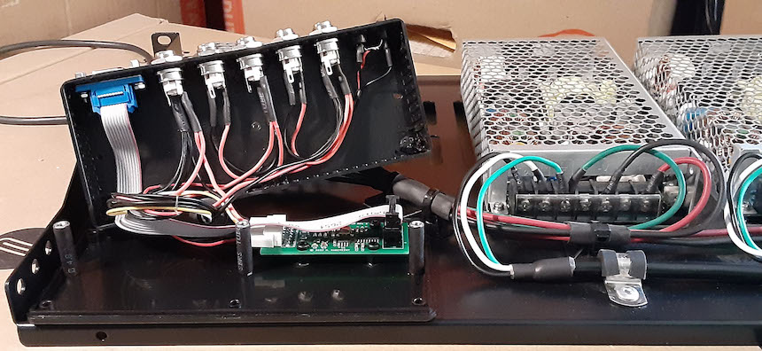
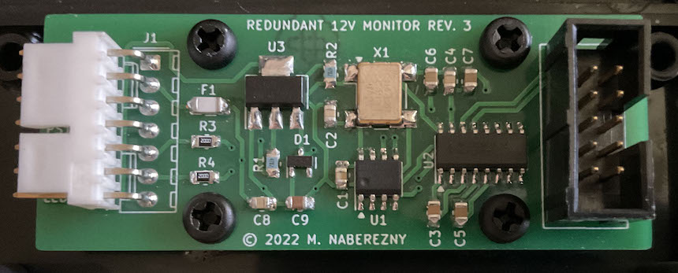

# Hardware

The redundant power supply is mostly wired by hand but a printed circuit board with a microcontroller is used to report the status to a PC.  The board was designed using KiCad 6.  The [schematic](./schematic.pdf) and [Gerber files](./gerbers.zip) are the final version.  See [`firmware/`](../firmware) for how to program the microcontroller.

## Photos

